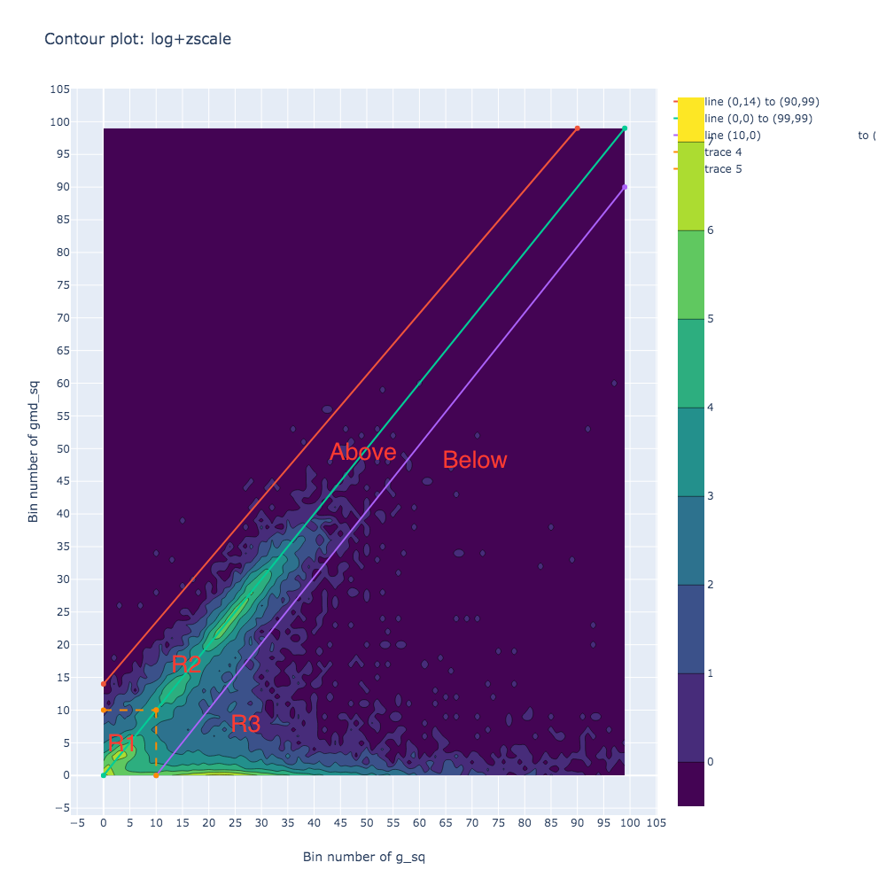
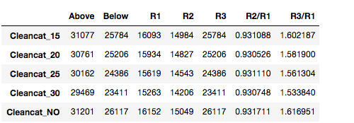

|  Notebook | Rendered   | Description  |  Author |
|---|---|---|---|
| a01_gmd_sq_larger_than_bin10_file0_cleancat.ipynb  | [ipynb](https://github.com/bpRsh/2019_shear_analysis_after_dmstack/blob/master/Dec_2019/Dec_05/a01_gmd_sq_larger_than_bin10_file0_cleancat.ipynb), [rendered](https://nbviewer.jupyter.org/github/bpRsh/2019_shear_analysis_after_dmstack/blob/master/Dec_2019/Dec_05/a01_gmd_sq_larger_than_bin10_file0_cleancat.ipynb)  |   | [Bhishan Poudel](https://bhishanpdl.github.io/)  |

# Contour Plot of g_sq vs gmd_sq

# Statistics of three regions

