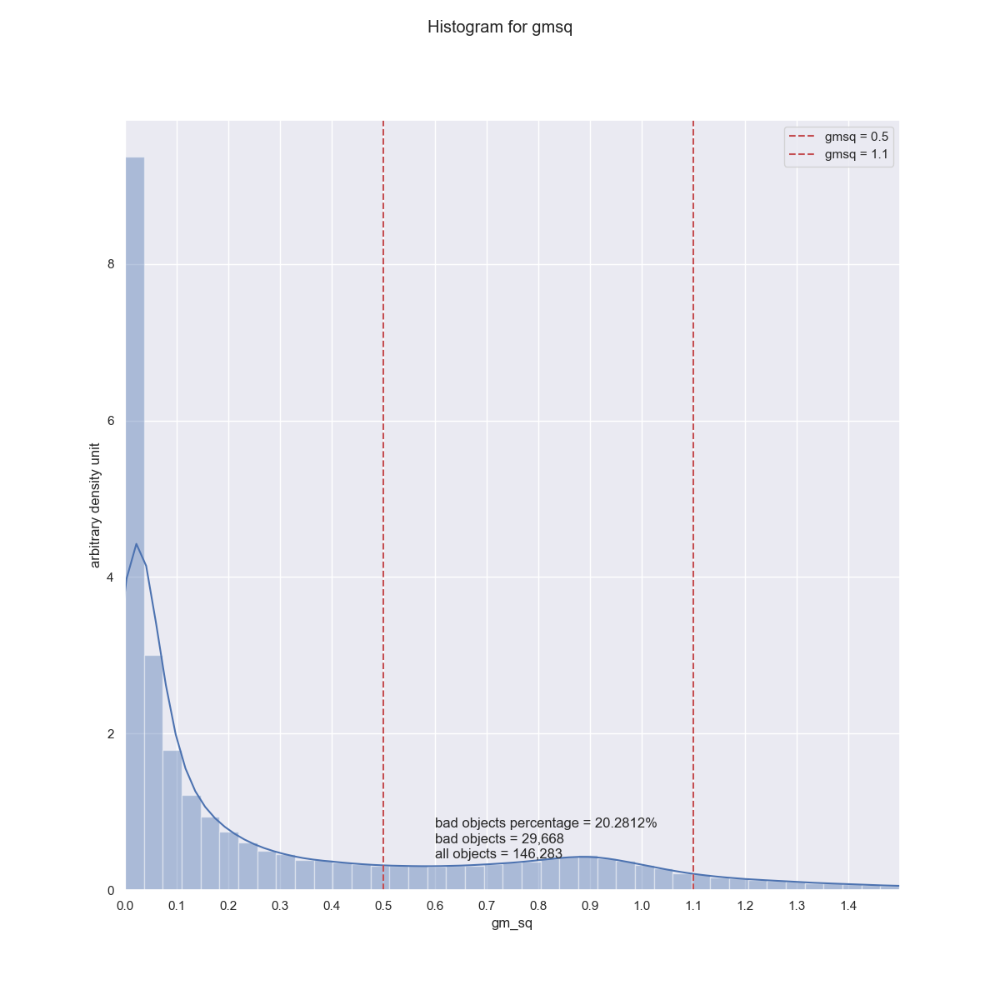
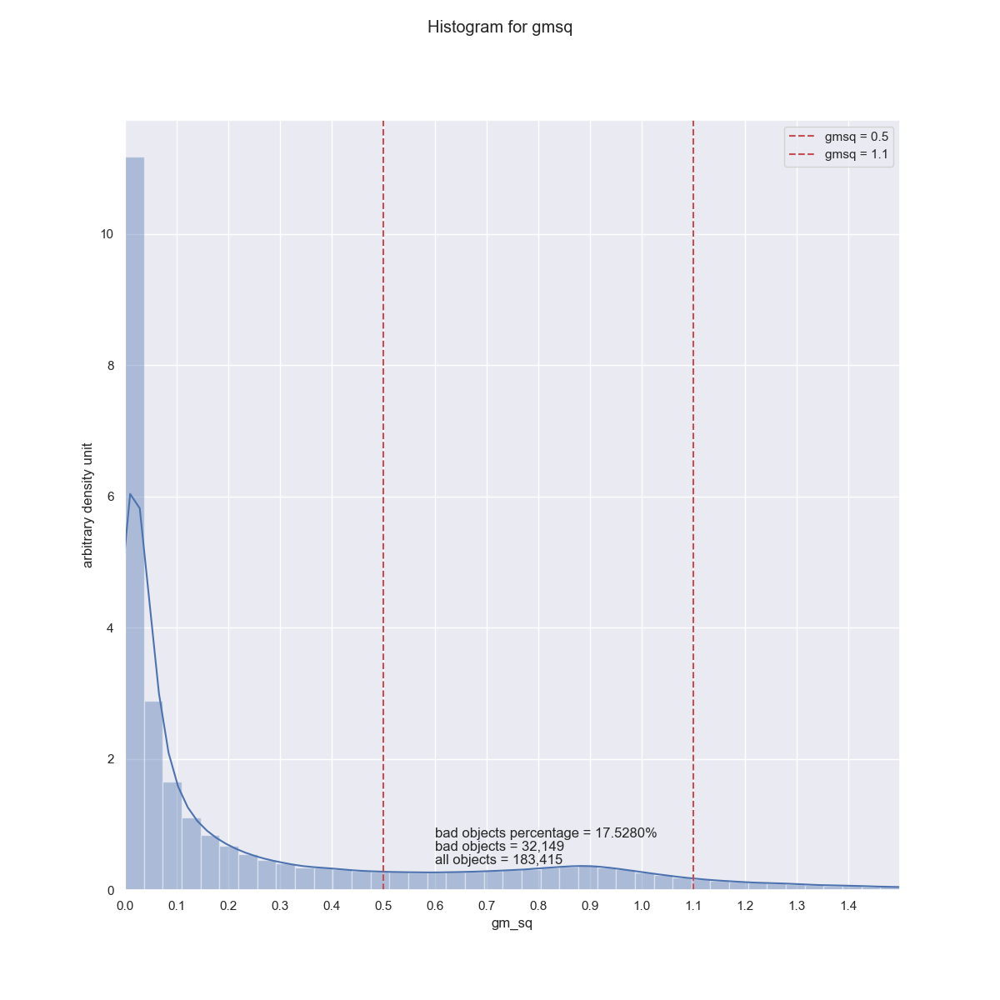

**Nov 8, 2019 Friday**  

# Highest and Lowest bad objects density

There are 90 flags and for all cased I have used the filter calib psf candidate is 
False. Using this I get 17.6574% objects in the range 0.5 < gmsq < 1.1.

For most of the flags I see this same number, but for some specific flags I got
some max and in object density.


```bash
Flag Number     Bad%               Flag Names
---------------------------------------------------------------------------------
26, 29       = 17.52% (minimum)   base_SdssShape_flag, base_SdssShape_flag_shift
5            = 19.63% (2nd min)   deblend_deblendedAsPsf
most of them = 17.65%
56           = 17.66%
67,72        = 17.67%
63,66        = 17.68%
0            = 20.28% (2nd max)    calib_detected
85,86        = 20.48% (max)        base_Variance_flag,base_Variance_flag_emptyFootprint
```

# Images
**Flag 0 : calib_detected**


**Flag 1 : calib_psfCandidate (I have used this for all cases)**


**Flag 2 : calib_psfUsed**


**Flag 3 : calib_psfReserved**


**Flag 4 : flags_negative**


**Flag 5 : deblend_deblendedAsPsf**


**Flag 26 : base_SdssShape_flag**


**Flag 29 : base_SdssShape_flag_shift**


**Flag 85 : base_Variance_flag**


**Flag 86 : base_Variance_flag_emptyFootprint**

