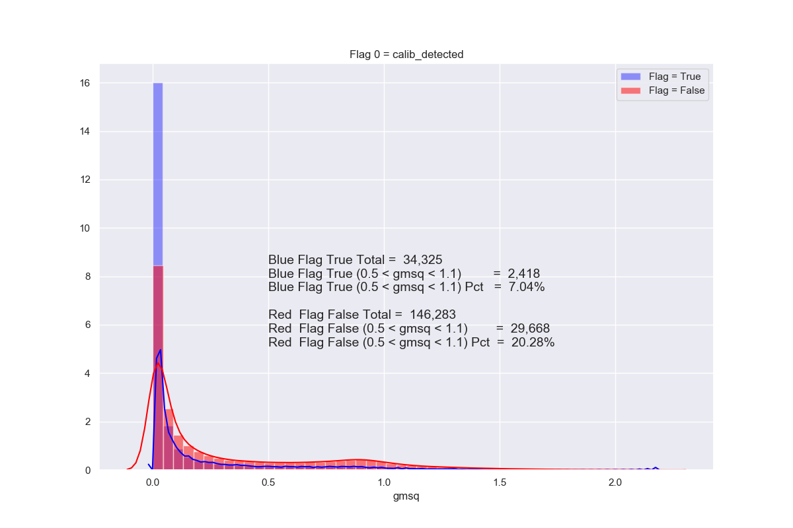
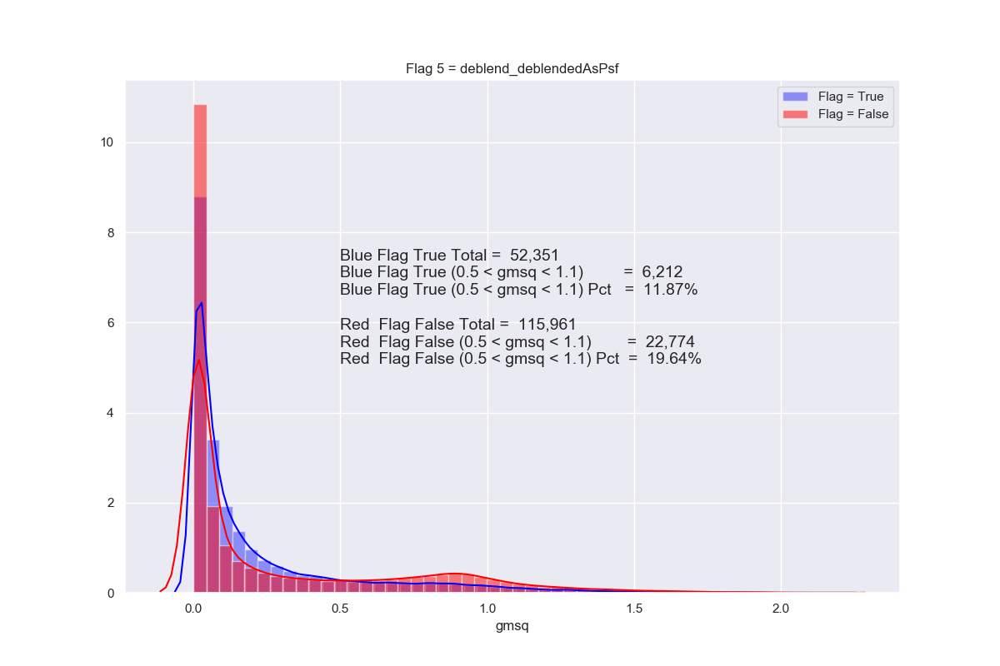
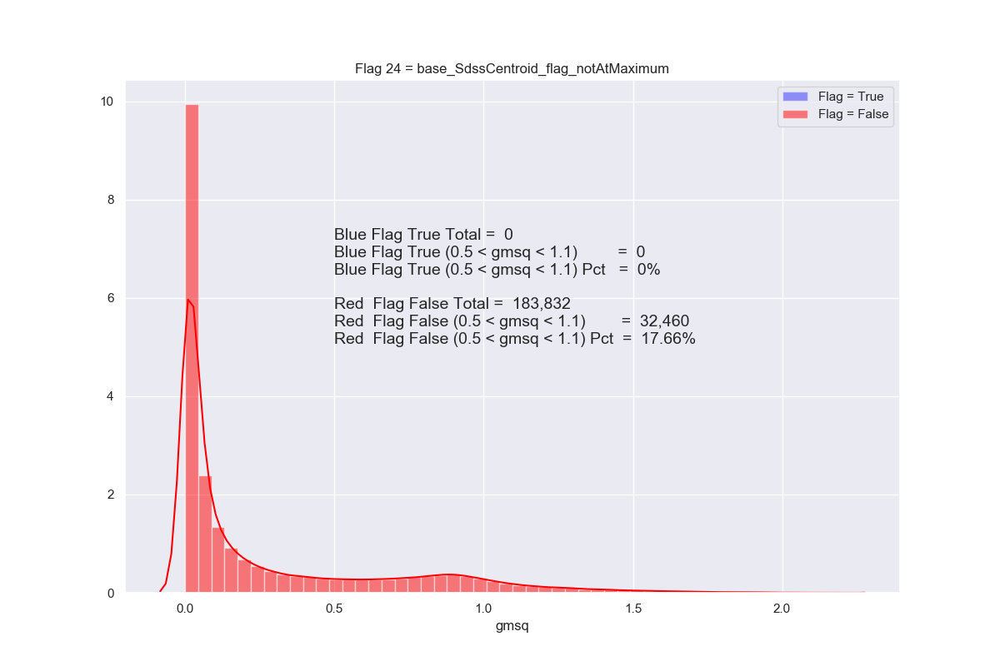
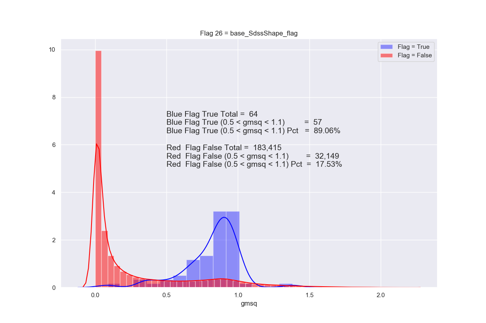
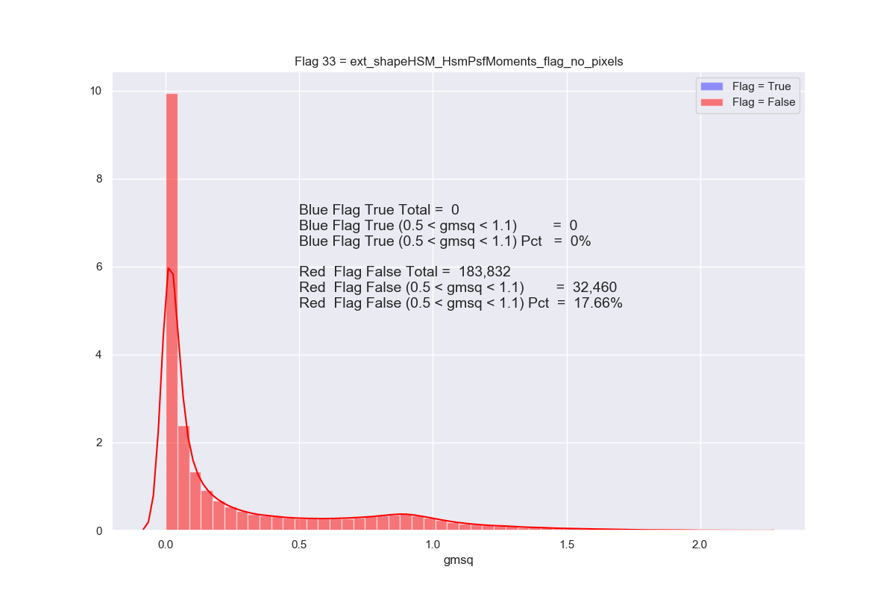
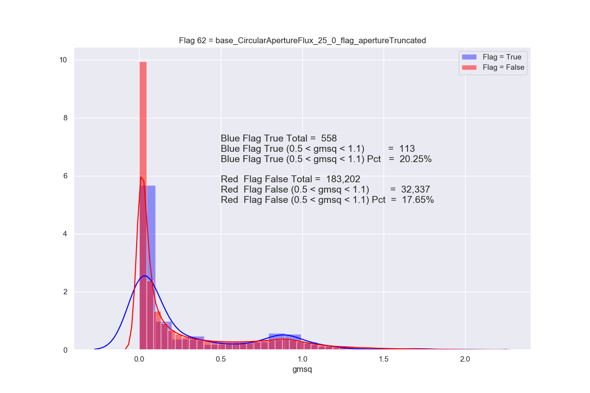
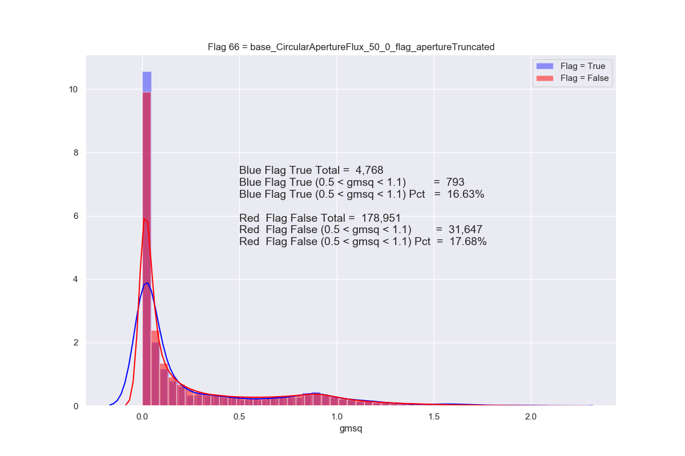
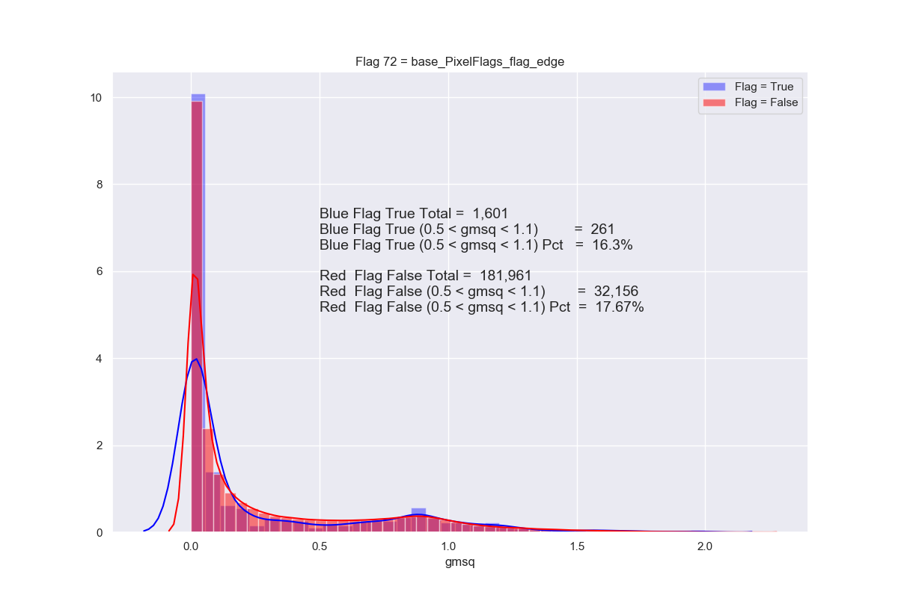
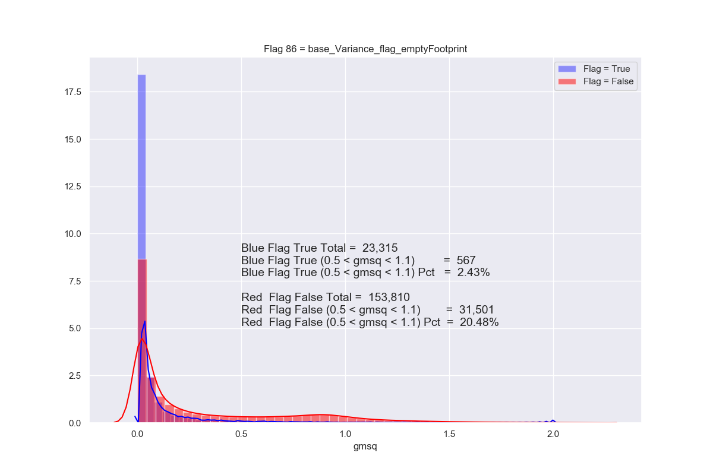

# Histogram plots of gmsq when flag=True and flag = False.
Note: For all of the 90 cases I have used flag calib_psfCandidate = False.
So, for example when I mean flag 0 calib_detected, this means flag calib psf candidate is already set to false and this new effects of 
this new flag is studied when set true or false.

```                        
                                                      (this flag is false in all the cases)
calib_detected = True means   calib_detected=True and calib_psf_candidate=false
calib_detected = False means  calib_detected=False and calib_psf_candidate=false


When I set the flag calib psf candidate to false, it also causes so many other flags also to be false, and there is only flag=false
histograms.
```



























