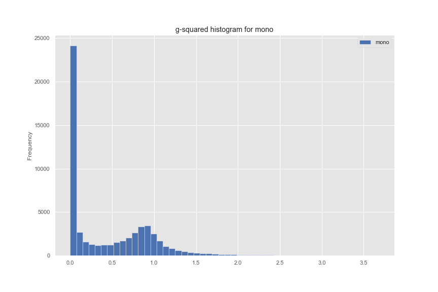
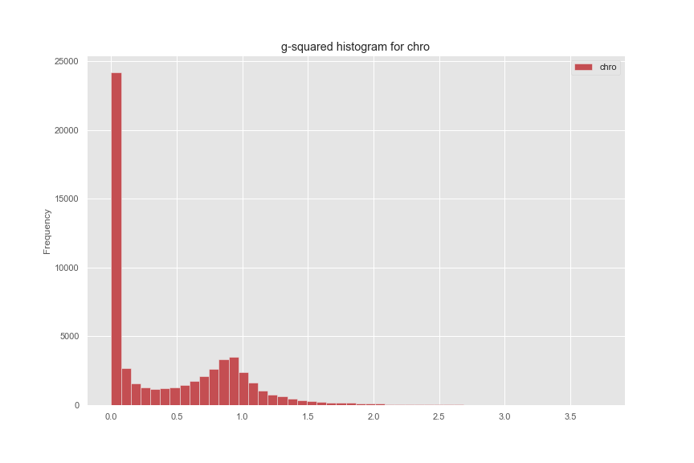

# Introduction
Date: Nov 19, 2019

**Update Nov 19**  
Reference: https://github.com/LSSTDESC/DC2-analysis/blob/master/tutorials/object_gcr_2_lensing_cuts.ipynb
- When creating dmstack_txt from dmstack_csv, we applied two more filters for shape measurements.
```python
    df = df.query('ext_shapeHSM_HsmShapeRegauss_resolution >= 0.3')
    df = df.query('ext_shapeHSM_HsmShapeRegauss_sigma <= 0.4')
    df = df.query('ext_shapeHSM_HsmShapeRegauss_flag== 0.0')
```

**IMCAT Script to get final_text.txt from dmstack_txt**
1. Added two new columns to imcat output catalog
```bash
lc -b +all 
'x = %x[0][0] %x[1][0] + %x[2][0] + %x[3][0] + 4 / %x[0][1] %x[1][1] + %x[2][1] + %x[3][1] + 4 / 2 vector'
'gm = %g[0][0] %g[1][0] + 2 / %g[0][1] %g[1][1] + 2 / 2 vector' 
'gc = %g[2][0] %g[3][0] + 2 / %g[2][1] %g[3][1] + 2 / 2 vector'   
'gmd = %g[0][0] %g[1][0] - 2 / %g[0][1] %g[1][1] - 2 / 2 vector' 
'gcd = %g[2][0] %g[3][0] - 2 / %g[2][1] %g[3][1] - 2 / 2 vector' 
< ${catalogs}/merge.cat > ${final}/final_${i}.cat
```


**Usual Filtering**

```python
df = df.query('calib_psfCandidate == 0.0')
df = df.query('deblend_nChild == 0.0')
df['ellip'] = np.hypot( df['ext_shapeHSM_HsmShapeRegauss_e1'] ,
                        df['ext_shapeHSM_HsmShapeRegauss_e2'] )
df = df.query('ellip < 2.0')

select only few columns after filtering:
cols_select = ['base_SdssCentroid_x', 'base_SdssCentroid_y',
                'base_SdssCentroid_xSigma','base_SdssCentroid_ySigma',
                'ext_shapeHSM_HsmShapeRegauss_e1','ext_shapeHSM_HsmShapeRegauss_e2',
                'base_SdssShape_flux']
 df = df[cols_select]        

# drop all nans
df = df.dropna()
```

**Notes**
- In IMCAT scripts, the quantity g is actually e. True g is g/2 in weak lensing limit.

# Images


