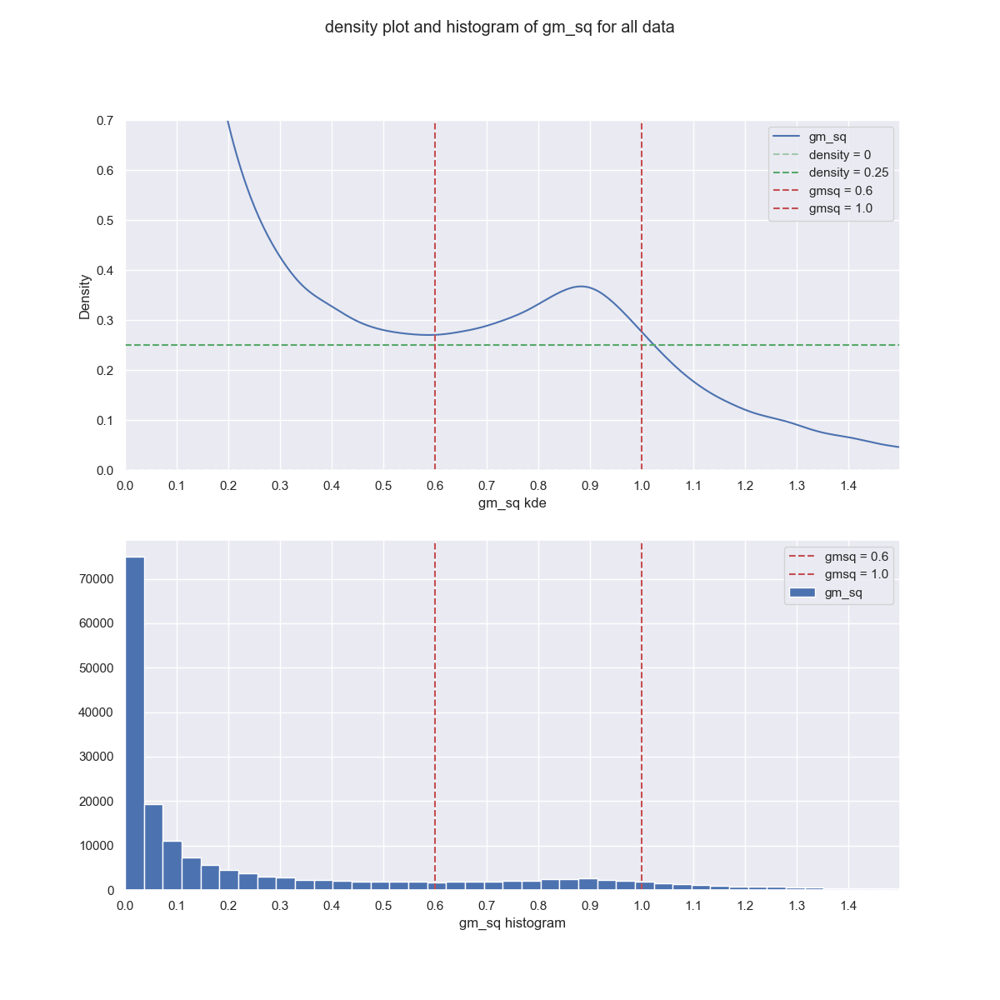
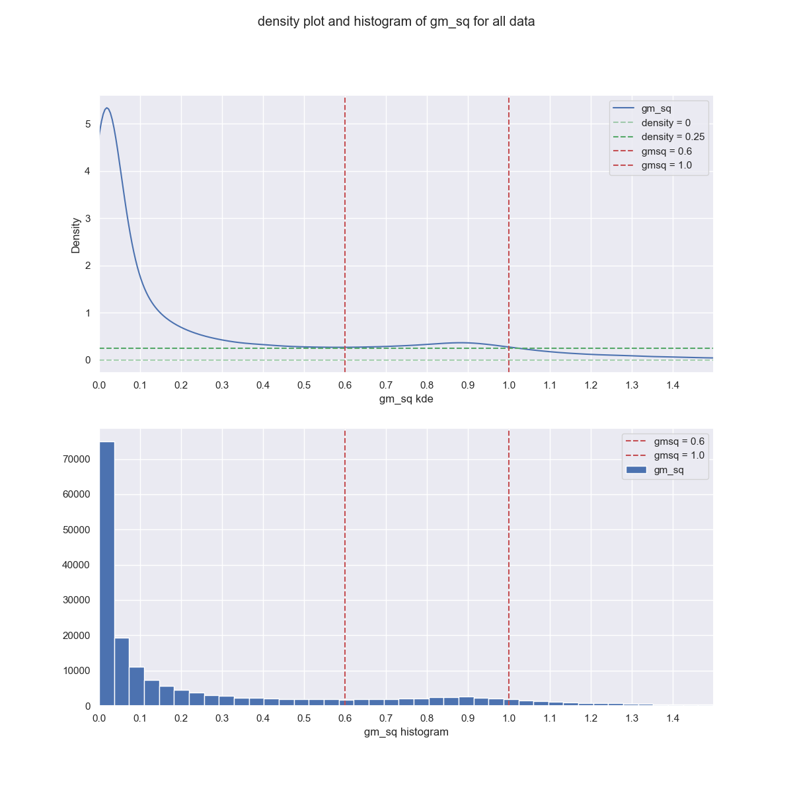

# Notebooks
- [a00_remove_nans_dmstack.ipynb](https://nbviewer.jupyter.org/github/bpRsh/2019_shear_analysis_after_dmstack/blob/master/Nov_2019/nov1_2019/a00_remove_nans_dmstack.ipynb)
- [a01_gmsq_bad_density_plot_nov1.ipynb](https://nbviewer.jupyter.org/github/bpRsh/2019_shear_analysis_after_dmstack/blob/master/Nov_2019/nov1_2019/a01_gmsq_bad_density_plot_nov1.ipynb)

# Introduction
Date: Nov 6, 2019

final_text.txt is created by imcat program after merging four lsst files (m,m9,l,l9)
after cleaning.

- DMSTACK gives csv files with lots of nans
- We need to remove nans, and select few columns, and do some filtering.
- After doing cleaning and using IMCAT to combine m,m9,l,l9 text files
  I got final_text.txt file which have columns like gm0 and gm1.
- I plotted the number density of gmsq = gm0_sq + gm1_sq and saw that
  there was a bump in the number density when 0.6 < gmsq < 1.0.
- About 10% objects were bad objects (i.e. 0.6 < gmsq < 1.0).


The filtering used to get clean text files from unclean dmstack csv files are given below    
#-------------------------------------------------------------
```
original dmstack output: src_lsst90_z1.5_000.csv,   shape = (7610, 167)
add two columns ellip and radius, shape = (7610, 169)
```


```python
cols_imp = ['base_GaussianCentroid_flag',
       'base_GaussianCentroid_flag_resetToPeak', 'base_SdssCentroid_flag',
       'base_SdssCentroid_flag_edge',
       'base_SdssCentroid_flag_almostNoSecondDerivative',
       'base_SdssCentroid_flag_notAtMaximum',
       'base_SdssCentroid_flag_resetToPeak',
       'base_SdssShape_flag_unweightedBad',
       'base_SdssShape_flag_unweighted', 'base_SdssShape_flag_maxIter',
       'ext_shapeHSM_HsmPsfMoments_flag',
       'ext_shapeHSM_HsmPsfMoments_flag_galsim',
       'ext_shapeHSM_HsmSourceMoments_flag',
       'ext_shapeHSM_HsmSourceMoments_flag_galsim',
       'base_CircularApertureFlux_3_0_flag',
       'base_CircularApertureFlux_4_5_flag',
       'base_CircularApertureFlux_4_5_flag_sincCoeffsTruncated',
       'base_CircularApertureFlux_6_0_flag',
       'base_CircularApertureFlux_6_0_flag_sincCoeffsTruncated',
       'base_CircularApertureFlux_9_0_flag',
       'base_CircularApertureFlux_12_0_flag',
       'base_CircularApertureFlux_12_0_flag_apertureTruncated',
       'base_CircularApertureFlux_17_0_flag',
       'base_CircularApertureFlux_17_0_flag_apertureTruncated',
       'base_GaussianFlux_flag', 'base_PsfFlux_flag',
       'base_PsfFlux_flag_edge', 'base_ClassificationExtendedness_flag']

```

**Attempt 1**
Usual filtering:
```
calib_psfCandidate == 0.0
deblend_nChild == 0.0
ellip < 1.5
after filtering, shape = (2315, 169)   # from 7.6k to 2.3k
    
    
    
all objects = 183,832
bad objects = 23,444
bad objects percentage = 12.75% 
```




**Attempt 2**
Use all those 28 filterings.
This gives extremely low number of objects. If we exclude nans there are ZERO
objects. So I will include nans in errx and erry.
```
if all 28 flags == False:
    object is good 
else:
    object is bad (0.6 < gmsq < 1.0)
    
    
all objects = 183,830
bad objects = 23,444
bad objects percentage = 12.75% 
```



**Attempt 3**
Take few columns from 28 features and choose only rows
where these features equal zero.
```
all objects = 183,830
bad objects = 23,444
bad objects percentage = 12.75% 

```


